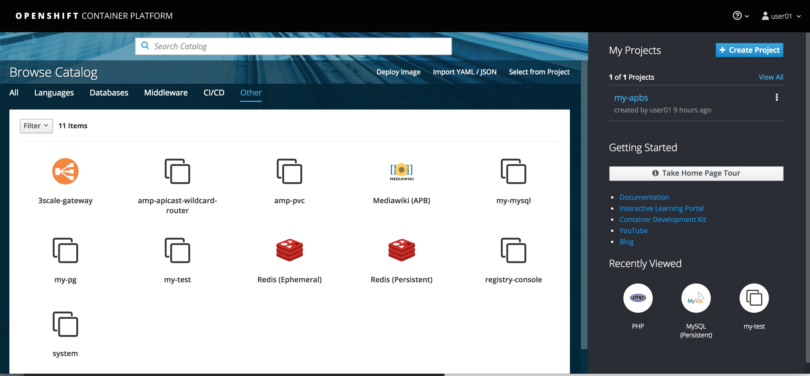
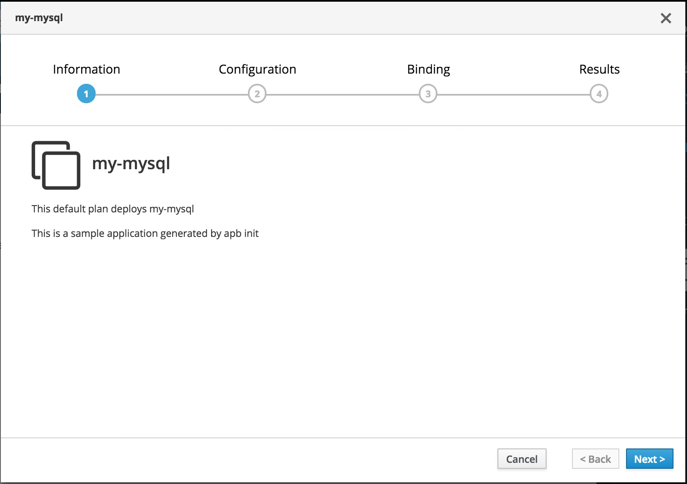
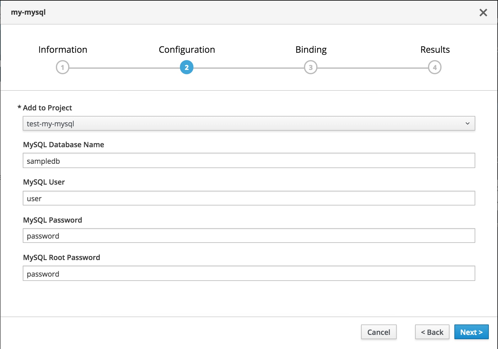
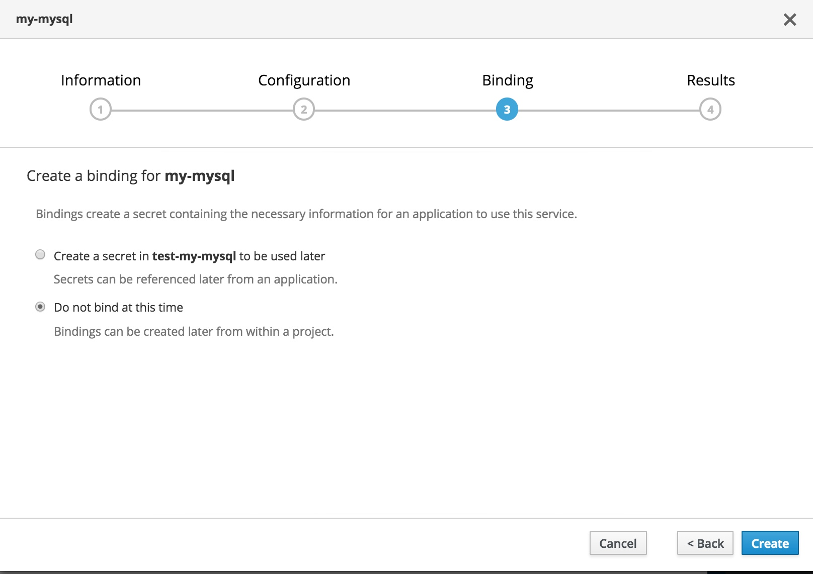
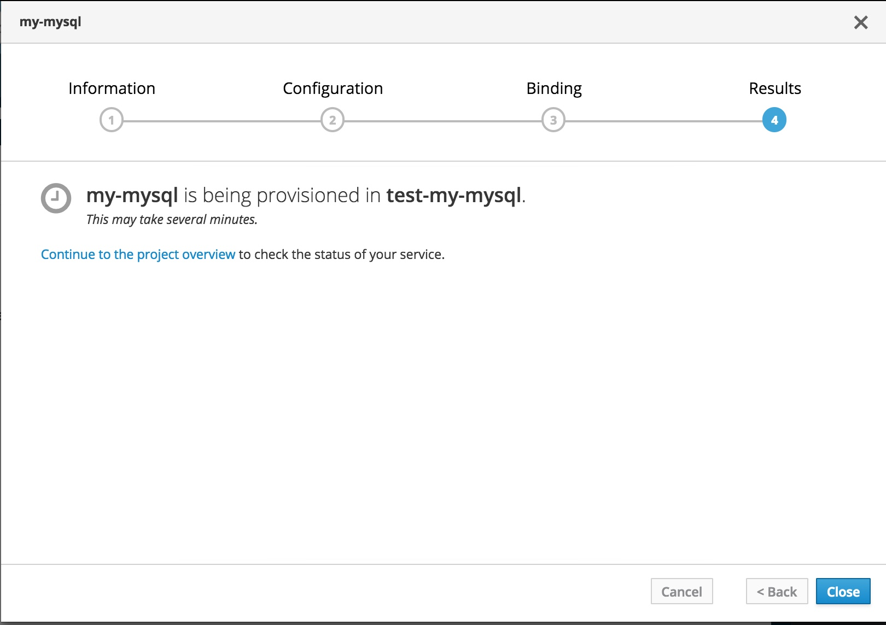
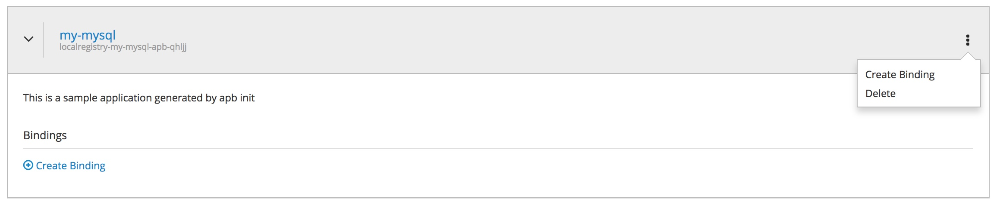
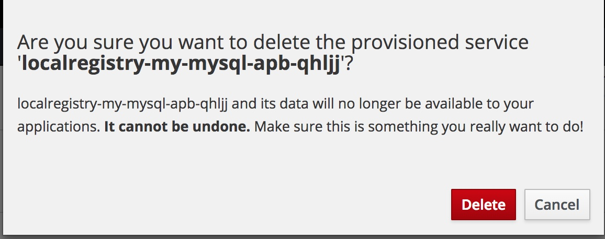

# Using Ansible Playbook Bundles 

You can use `apb` as a tool to create your own APBs. The documentation to use `apb` is available at [https://docs.openshift.com/container-platform/3.7/apb_devel/writing/getting_started.html#apb-devel-writing-gs-bind-prep](https://docs.openshift.com/container-platform/3.7/apb_devel/writing/getting_started.html#apb-devel-writing-gs-bind-prep). Here we will cover the specifics of how to do it from an external host.


## Prerequisites
### Install APB


I am using a RHEL box as an external host. *TBD: Yet to try on a MAC*

On a RHEL box you will need to enable `rhel-7-server-ose-3.7-rpms` channel using:	

```
$ sudo subscription-manager repos --enable="rhel-7-server-ose-3.7-rpms"
```
Of course you need sudo.

Now install `apb` tool by running

```
$ sudo yum install apb
```

Verify that apb works

```
$ apb -h
usage: apb [-h] [--debug] [--project BASE_PATH]
           {relist,init,test,help,prepare,push,bootstrap,list,remove,build}
           ...

APB tooling for assisting in building and packaging APBs.

optional arguments:
  -h, --help            show this help message and exit
  --debug               Enable debug output
  --project BASE_PATH, -p BASE_PATH
                        Specify a path to your project. Defaults to CWD.

subcommand:
  {relist,init,test,help,prepare,push,bootstrap,list,remove,build}
    relist              Relist the APBs available within the Service Catalog
    init                Initialize the directory for APB development
    test                Test the APB
    help                Display this help message
    prepare             Prepare an ansible-container project for APB packaging
    push                Push local APB spec to an Ansible Service Broker
    bootstrap           Tell Ansible Service Broker to reload APBs from the
                        container repository
    list                List APBs from the target Ansible Service Broker
    remove              Remove APBs from the target Ansible Service Broker
    build               Build and package APB container

```

### Setup a namespace for your APBs

Log into your openshift cluster

```
$ oc login <<your master url>> -u user01
```

Ansible Playbook Bundle will be created as a container image and stored in a registry. You will need access to that registry if you want to push images.


Create a new project.

```
$ oc new-project my-apbs
Now using project "my-apbs" on server "https://master.devday.ocpcloud.com:443".

You can add applications to this project with the 'new-app' command. For example, try:

    oc new-app centos/ruby-22-centos7~https://github.com/openshift/ruby-ex.git

to build a new example application in Ruby.
```
Since you created it, you are the administrator for this project. 

Let us provide access to be able to push images to this registry

```
$ oc adm policy add-role-to-user system:image-builder user01
role "system:image-builder" added: "user01"
```

### Connect to the Docker Registry

You can use `apb` tool to connect to any registry. In this case, I am connecting to the registry on my OpenShift cluster.

------------

**ADMIN TASKS:** 

Your administrator should provide you the registry URL to your OpenShift environment and a certificate to connect to the container registry. 

They would run `oc get route` in the `default` project to get the registry URL. 

```
# oc get route -n default
NAME               HOST/PORT                                           PATH      SERVICES           PORT      TERMINATION   WILDCARD
docker-registry    docker-registry-default.apps.devday.ocpcloud.com                docker-registry    <all>     passthrough   None
```

This is a secure registry. So you would get a certificate to connect to this registry as well. In a typical experimental cluster you may have used the default certificates that openshift configures for you. The `ca.crt` can be copied from `/etc/origin/master/ca.crt` to the host where you want to login from

---------------


Copy the certificate to the `/etc/docker/certs.d/<<registryURL>>`. An example is shown below

```
# ls /etc/docker/certs.d/docker-registry-default.apps.devday.ocpcloud.com/
ca.crt
```

Find your token to use as password to login to docker

```
$ oc whoami -t
tmxbDKjziPUKj1BA31pem4bkqZcTMuID5DGqeJg6JdU

```

Log in to the registry now using docker login using the token as the password.

```
$ docker login -u user01 -p tmxbDKjziPUKj1BA31pem4bkqZcTMuID5DGqeJg6JdU docker-registry-default.apps.devday.ocpcloud.com
Login Succeeded
```

## Creating your own APB

`apb` tool that we installed earlier helps us create a template with a structure that we can use to create our own APB. It creates a directory structure with ansible roles to

- provision a service
- deprovision a service
- bind your service (example : a database) to a client service 
- unbind your service

You can skip certain steps too. As an example, if your service doesn't get bound to another service you can skip the *bind* and *unbind*

Run `apb init -h` to understand all these options.


### Create a new APB

Use `apb init` to create a new ansible playbook bundle. In my case I named it `my-mysql`. The parameter `bindable` is use since I want to make my service bindable.

```
$ apb init my-mysql --bindable
Initializing /home/veer/my-mysql for an APB.
Generating playbook files
Successfully initialized project directory at: /home/veer/my-mysql
Please run *apb prepare* inside of this directory after editing files.
```

`apb init` creates the following structure for you. Note the four roles i.e, provision, deprovision, bind and unbind.


```
$ ls -R my-mysql
my-mysql:
apb.yml  Dockerfile  playbooks  roles

my-mysql/playbooks:
bind.yml  deprovision.yml  provision.yml  unbind.yml

my-mysql/roles:
bind-my-mysql  deprovision-my-mysql  provision-my-mysql  unbind-my-mysql

my-mysql/roles/bind-my-mysql:
tasks

my-mysql/roles/bind-my-mysql/tasks:
main.yml

my-mysql/roles/deprovision-my-mysql:
tasks

my-mysql/roles/deprovision-my-mysql/tasks:
main.yml

my-mysql/roles/provision-my-mysql:
tasks

my-mysql/roles/provision-my-mysql/tasks:
main.yml

my-mysql/roles/unbind-my-mysql:
tasks

my-mysql/roles/unbind-my-mysql/tasks:
main.yml
```

Change into the `my-mysql` directory

```
$ cd my-mysql/
```

### Edit APB Specification

The APB specification is in `apb.yml` with the following contents

```
$ cat apb.yml
version: 1.0
name: my-mysql
description: This is a sample application generated by apb init
bindable: True
async: optional
metadata:
  displayName: my-mysql
plans:
  - name: default
    description: This default plan deploys my-mysql
    free: True
    metadata: {}
    parameters: []
```
Note the attribute `bindable: True`. This was set based on `--bindable` when we created the apb.

Let us edit it to add the `parameters` to be passed to our database.

```
    parameters:
      - name: mysql_database
        title: MySQL Database Name
        type: string
        default: sampledb
      - name: mysql_user
        title: MySQL User
        type: string
        default: user
      - name: mysql_password
        title: MySQL Password
        type: string
        default: password
```
Also change the name of the APB to `my-mysql-apb`. This is so that we can use regex white-listing (will be discussed later).

After edits your `apb.yml` should be like

```
]$ cat apb.yml 
version: 1.0
name: my-mysql-apb
description: This is a sample application generated by apb init
bindable: True
async: optional
metadata:
  displayName: my-mysql
plans:
  - name: default
    description: This default plan deploys my-mysql
    free: True
    metadata: {}
    parameters: 
      - name: mysql_database
        title: MySQL Database Name
        type: string
        default: sampledb
      - name: mysql_user
        title: MySQL User
        type: string
        default: user
      - name: mysql_password
        title: MySQL Password
        type: string
        default: password
      - name: mysql_root_password
        title: MySQL Root Password
        type: string
        default: password
```

### Edit Dockerfile

Dockerfile generated by apb by default uses base image `ansibleplaybookbundle/apb-base`. This image causes provisioning issues on an OpenShift Enterprise cluster. Let us change this to use `registry.access.redhat.com/openshift3/apb-base`. Post changes Dockerfile should be like this.
 
```
$ cat Dockerfile 
FROM registry.access.redhat.com/openshift3/apb-base

LABEL "com.redhat.apb.spec"=\

COPY playbooks /opt/apb/actions
COPY roles /opt/ansible/roles
RUN chmod -R g=u /opt/{ansible,apb}
USER apb
```

### Edit Provision and Deprovision Roles

Note that Provision playbook refers `provision-my-sql` role.

```
$ cat ./playbooks/provision.yml 
- name: my-mysql playbook to provision the application
  hosts: localhost
  gather_facts: false
  connection: local
  roles:
  - role: ansible.kubernetes-modules
    install_python_requirements: no
  - role: ansibleplaybookbundle.asb-modules
  - role: provision-my-mysql
    playbook_debug: false
```

Similarly Deprovision playbook refers the role `deprovision-my-mysql`

Current, `bind` and `unbind` roles are not being used. These will be added in the future. In the meanwhile, we will pass the credentials to the broker through an ansible module so that broker creates a secret.

Edit the provision script in `./roles/provision-my-mysql/tasks/main.yml ` to include ansible tasks to create a kubernetes persistent volume claim, kubernetes service and openshift deployment configuration for your database. Also add an `asb_encode_binding` task that will be used to pass parameters to the broker to create a secret that will be injected into a service that binds with this database service. 

```
$ cat ./roles/provision-my-mysql/tasks/main.yml 
- name: Create MySQL service
  k8s_v1_service:
    name: mysql 
    namespace: '{{ namespace }}'
    labels:
      app: mysql        
      service: mysql
    selector:
      app: mysql
      service: mysql 
    ports:
    - name: port-3306
      port: 3306
      protocol: TCP
      target_port: 3306
  register: mysql_service

- name: create volumes
  k8s_v1_persistent_volume_claim:
    name: mysql 
    namespace: '{{ namespace }}'
    state: present
    access_modes:
      - ReadWriteOnce
    resources_requests:
      storage: 1Gi

- name: Create MySQL deployment config
  openshift_v1_deployment_config:
    name: mysql 
    namespace: '{{ namespace }}'
    labels:
      app: mysql
      service: mysql 
    replicas: 1
    selector:
      app: mysql 
      service: mysql 
    spec_template_metadata_labels:
      app: mysql 
      service: mysql 
    containers:
    - env:
      - name: MYSQL_PASSWORD
        value: '{{ mysql_password }}'
      - name: MYSQL_USER
        value: '{{ mysql_user }}'
      - name: MYSQL_DATABASE
        value: '{{ mysql_database }}'
      - name: MYSQL_ROOT_PASSWORD
        value: '{{ mysql_root_password }}'
      image: registry.access.redhat.com/rhscl/mysql-57-rhel7
      livenessProbe:
        failureThreshold: 3
        initialDelaySeconds: 30
        periodSeconds: 10
        successThreshold: 1
        tcpSocket:
          port: 3306
        timeoutSeconds: 1
      readinessProbe:
        exec:
          command:
            - /bin/sh
            - '-i'
            - '-c'
            - >-
               MYSQL_PWD="$MYSQL_PASSWORD" mysql -h 127.0.0.1 -u $MYSQL_USER
               -D $MYSQL_DATABASE -e 'SELECT 1'
        failureThreshold: 3
        initialDelaySeconds: 5
        periodSeconds: 10
        successThreshold: 1
        timeoutSeconds: 1
      name: mysql 
      ports:
      - container_port: 3306 
        protocol: TCP
      termination_message_path: /dev/termination-log
      volume_mounts:
      - mount_path: /var/lib/mysql/data
        name: mysql-data
      working_dir: /
    volumes:
    - name: mysql-data
      persistent_volume_claim:
        claim_name: mysql
      test: false
      triggers:
      - type: ConfigChange

- name: Wait for database pod to come up
  wait_for:
    port: 3306 
    host: "{{ mysql_service.service.spec.cluster_ip }}"
    timeout: 300

- name: encode bind credentials
  asb_encode_binding:
    fields:
      DB_TYPE: mysql 
      DB_SERVICE_HOST: mysql 
      DB_SERVICE_PORT: "3306"
      DB_USER: "{{ mysql_user }}"
      DB_PASSWORD: "{{ mysql_password }}"
      DB_NAME: "{{ mysql_database }}"
``` 

In the same way edit the deprovision role. This role executes functionality to deprovision the service using the APB and delete the resources created by the provision role.

```
$ cat ./roles/deprovision-my-mysql/tasks/main.yml 

## Deprovision a service

- k8s_v1_service:
    name: mysql
    namespace: '{{ namespace }}'
    state: absent


## Deprovision a deployment config
## When removing a Deployment Config, OpenShift will automatically clean up
## its associated resources like replication controllers and pods

- openshift_v1_deployment_config:
    name: mysql
    namespace: '{{ namespace }}'
    state: absent

## Deprovision PVC
- k8s_v1_persistent_volume_claim:
    name: mysql
    namespace: '{{ namespace }}'
    state: absent
```

### Prepare and Build an Image	

Run `apb prepare` to prepare the project for APB packaging. This will update the `LABEL` in the Dockerfile with base64 encoded version of apb.yml .

This step is *optional*. If you don't prepare, the build step (next) will run a prepare anyway.

```
$ apb prepare
Finished writing dockerfile.

$ cat Dockerfile 
FROM registry.access.redhat.com/openshift3/apb-base

LABEL "com.redhat.apb.spec"=\
"dmVyc2lvbjogMS4wCm5hbWU6IG15LW15c3FsCmRlc2NyaXB0aW9uOiBUaGlzIGlzIGEgc2FtcGxl\
IGFwcGxpY2F0aW9uIGdlbmVyYXRlZCBieSBhcGIgaW5pdApiaW5kYWJsZTogVHJ1ZQphc3luYzog\
b3B0aW9uYWwKbWV0YWRhdGE6CiAgZGlzcGxheU5hbWU6IG15LW15c3FsCnBsYW5zOgogIC0gbmFt\
ZTogZGVmYXVsdAogICAgZGVzY3JpcHRpb246IFRoaXMgZGVmYXVsdCBwbGFuIGRlcGxveXMgbXkt\
bXlzcWwKICAgIGZyZWU6IFRydWUKICAgIG1ldGFkYXRhOiB7fQogICAgcGFyYW1ldGVyczogCiAg\
ICAgIC0gbmFtZTogbXlzcWxfZGF0YWJhc2UKICAgICAgICB0aXRsZTogTXlTUUwgRGF0YWJhc2Ug\
TmFtZQogICAgICAgIHR5cGU6IHN0cmluZwogICAgICAgIGRlZmF1bHQ6IHNhbXBsZWRiCiAgICAg\
IC0gbmFtZTogbXlzcWxfdXNlcgogICAgICAgIHRpdGxlOiBNeVNRTCBVc2VyCiAgICAgICAgdHlw\
ZTogc3RyaW5nCiAgICAgICAgZGVmYXVsdDogdXNlcgogICAgICAtIG5hbWU6IG15c3FsX3Bhc3N3\
b3JkCiAgICAgICAgdGl0bGU6IE15U1FMIFBhc3N3b3JkCiAgICAgICAgdHlwZTogc3RyaW5nCiAg\
ICAgICAgZGVmYXVsdDogcGFzc3dvcmQKICAgICAgLSBuYW1lOiBteXNxbF9yb290X3Bhc3N3b3Jk\
CiAgICAgICAgdGl0bGU6IE15U1FMIFJvb3QgUGFzc3dvcmQKICAgICAgICB0eXBlOiBzdHJpbmcK\
ICAgICAgICBkZWZhdWx0OiBwYXNzd29yZAo="

COPY playbooks /opt/apb/actions
COPY roles /opt/ansible/roles
RUN chmod -R g=u /opt/{ansible,apb}
USER apb
```

### Build the APB

At this point we are ready to build the APB. Run `apb build` using the above Dockerfile by pointing to the docker registry. In my case I am using the openshift registry `docker-registry-default.apps.devday.ocpcloud.com`. We also want the image to be pushed to an imagestream in the namespace `my-apbs`.

```
$ apb build --registry docker-registry-default.apps.devday.ocpcloud.com --org my-apbs
Finished writing dockerfile.
Building APB using tag: [docker-registry-default.apps.devday.ocpcloud.com/my-apbs/my-mysql-apb]
Successfully built APB image: docker-registry-default.apps.devday.ocpcloud.com/my-apbs/my-mysql-apb
```

If you check your docker images now, you should see the newly created `my-mysql` image.

```
$ docker images
REPOSITORY                                                              TAG                 IMAGE ID            CREATED             SIZE
docker-registry-default.apps.devday.ocpcloud.com/my-apbs/my-mysql-apb   latest              746f5ff87a33        4 minutes ago       655 MB
```

### Push the image to Registry

Normally you would use `apb push` to accomplish this step. Currently there are some limitations of doing a push from outside the openshift cluster and a role needs to be created to run this push. 

As an alternative we are using `docker push` followed by a bootstrap. **Note** that we logged into the registry earlier and we can run a push now.

```
$ docker push docker-registry-default.apps.devday.ocpcloud.com/my-apbs/my-mysql-apb:latest
The push refers to a repository [docker-registry-default.apps.devday.ocpcloud.com/my-apbs/my-mysql-apb]
85cb6f2b90fe: Pushed 
53044c5960af: Pushed 
cd6823d3f175: Pushed 
47ffc903b2fa: Mounted from my-apbs/my-mysql 
273d61014330: Mounted from my-apbs/my-mysql 
1afb15ed6241: Mounted from my-apbs/my-mysql 
latest: digest: sha256:9d60901b4560547155fe3a11bed143906197f8ebacbcf6ad5864955314335665 size: 1573
```

Now if you check the imagestreams in the my-apbs namespace you will find a new one that was just pushed. Also describe the imagestream to see the container image that it is pointing to.

```
$ oc get is -n my-apbs
NAME           DOCKER REPO                                             TAGS      UPDATED
my-mysql-apb   docker-registry.default.svc:5000/my-apbs/my-mysql-apb   latest    Less than a second ago

$ oc describe is my-mysql-apb -n my-apbs
Name:			my-mysql-apb
Namespace:		my-apbs
Created:		Less than a second ago
Labels:			<none>
Annotations:		<none>
Docker Pull Spec:	docker-registry.default.svc:5000/my-apbs/my-mysql-apb
Image Lookup:		local=false
Unique Images:		1
Tags:			1

latest
  no spec tag

  * docker-registry.default.svc:5000/my-apbs/my-mysql-apb@sha256:9d60901b4560547155fe3a11bed143906197f8ebacbcf6ad5864955314335665
      Less than a second ago
```


### Bootstrap the Ansible Service Broker and Populate Service Catalog

Currently `bootstrap` and `list` steps require cluster-admin access. Hence have to be performed by a user with admin access. An admin user with cluster-admin role can run these commands from a box on which APB is installed. So all the commands in this section are currently meant for a user with `cluster-admin` access.

**Note** This section may change in the future as a role for asb-developer is created.


---------------
**ADMIN TASKS**

So how is this `cluster-admin` access given to let's say a user named `admin-user`?

```
# oc adm policy add-cluster-role-to-user cluster-admin admin-user
```
and then login as the `admin-user` to perform these tasks.

Ansible Service Broker runs as a pod in the project named `openshift-ansible-service-broker`. It saves the configuration in an `asb-etcd` pod that is backed by a persistent volume.

```
# oc get pods -n openshift-ansible-service-broker 
NAME               READY     STATUS    RESTARTS   AGE
asb-9-ghz4g        1/1       Running   0          43m
asb-etcd-2-dplpg   1/1       Running   2          2d

# oc get pvc -n openshift-ansible-service-broker 
NAME      STATUS    VOLUME             CAPACITY   ACCESSMODES   STORAGECLASS   AGE
etcd      Bound     etcd-vol2-volume   1G         RWO                          10d

```

The broker configuration is read from a configmap named `broker-config`

```
# oc get configmap -n openshift-ansible-service-broker 
NAME            DATA      AGE
broker-config   1         11d
```

Describe this configmap and read the documentation about this configuration  here [https://github.com/openshift/ansible-service-broker/blob/master/docs/config.md](https://github.com/openshift/ansible-service-broker/blob/master/docs/config.md). 

**Note** The below configuration is already edited.

```
# oc describe configmap -n openshift-ansible-service-broker 
Name:		broker-config
Namespace:	openshift-ansible-service-broker
Labels:		app=openshift-ansible-service-broker
Annotations:	<none>

Data
====
broker-config:
----
registry:
  - type: rhcc
    name: rh
    url:  https://registry.access.redhat.com
    org:  
    tag:  v3.7
    white_list: [.*-apb$]

  - type: local_openshift
    name: localregistry
    namespaces: ['openshift','my-apbs']
    white_list: [.*-apb$]

dao:
  etcd_host: asb-etcd.openshift-ansible-service-broker.svc
  etcd_port: 2379
  etcd_ca_file: /var/run/secrets/kubernetes.io/serviceaccount/service-ca.crt
  etcd_client_cert: /var/run/asb-etcd-auth/client.crt
  etcd_client_key: /var/run/asb-etcd-auth/client.key
log:
  stdout: true
  level: debug
  color: true
openshift:
  host: ""
  ca_file: ""
  bearer_token_file: ""
  sandbox_role: edit
  image_pull_policy: Always
  keep_namespace: true
  keep_namespace_on_error: true
broker:
  dev_broker: false
  bootstrap_on_startup: true
  refresh_interval: 600s
  launch_apb_on_bind: false
  output_request: false
  recovery: true
  ssl_cert_key: /etc/tls/private/tls.key
  ssl_cert: /etc/tls/private/tls.crt
  auto_escalate: False
  auth:
    - type: basic
      enabled: false

Events:	<none>
```
This broker-config is configured to read from two registries 
1. RHCC - [registry.access.redhat.com](registry.access.redhat.com)
2. Local Registry - that by default points to namespace `openshift`

The admin would have to edit include `my-apbs`. Also you would have to include a `white_list` based on either specific names or regular expressions. In this case, I added a `white_list` with value `[.*-apb$]`. Broker will use this to pickup any images that have `apb` in their name and configure them as apbs. *Hence you would understand why we renamed the apb in the `apb.yml` to `my-mysql-apb` in the beginning*

```
  - type: local_openshift
    name: localregistry
    namespaces: ['openshift','my-apbs']
    white_list: [.*-apb$]
```

I also made a few other changes to this configmap. In the following section `image_pull_policy` has been changed to `Always` and `keep-namespace` has been changed to `true` (at least temporarily). 

```
openshift:
  host: ""
  ca_file: ""
  bearer_token_file: ""
  sandbox_role: edit
  image_pull_policy: Always
  keep_namespace: true
  keep_namespace_on_error: true
```

When an apb service is provisioned, the provisioning step runs as a pod in a temporary project that will be deleted after the provisioning is complete. If you want to retain this project and the pod, you would want the `keep_namespace` set to `true`. 
*I changed it to `true` as we are still learning to use ASB and we want to debug if something goes wrong*.

So how does an administrator make these changes?

```
# oc edit configmap broker-config -n openshift-ansible-service-broker
```
or use OpenShift Webconsole.

**Note** that the content inside this configmap is saved as data. So editing from a text editor is tricky. It may be easier to do this from a Webconsole.

Once the configmap is changed, you will also need to redeploy the `asb` pod to load the changes

```
# oc rollout latest asb
deploymentconfig "asb" rolled out
```

In order to run bootstrap, you will need the URL/Route for ansible service broker. Your administrator can find it by running the following command:

```
# oc get route -n openshift-ansible-service-broker 
NAME       HOST/PORT                                                            PATH      SERVICES   PORT      TERMINATION   WILDCARD
asb-1338   asb-1338-openshift-ansible-service-broker.apps.devday.ocpcloud.com             asb        1338      reencrypt     None
```

Admin user should use the above URL with a suffix `/ansible-service-broker/v2/catalog` to bootstrap the broker. The ansible service broker will load the new apb from the registry. 

Also we haven't figured out a way to run `apb bootstrap` from a box that this not an OpenShift Master. Hence we will use `curl` for bootstrapping.

```
# curl -X POST -H "authorization: bearer $(kubectl get secrets asb-client -n openshift-ansible-service-broker -o jsonpath='{ .data.token }' | base64 -d)" --insecure https://asb-1338-openshift-ansible-service-broker.apps.devday.ocpcloud.com/ansible-service-broker/v2/bootstrap

output:
{
  "spec_count": 11,
  "image_count": 11
}
```

Now list the apbs with `apb list` commands to verify that the my-mysql-apb is visible. Note the broker URL here is *SubstituteAnsibleServiceBrokerURL*/ansible-service-broker. Currently this command also needs to be run by a user with `cluster-admin` access.

```
$ apb list --broker https://asb-1338-openshift-ansible-service-broker.apps.devday.ocpcloud.com/ansible-service-broker
ID                                NAME                        DESCRIPTION                                         
bb1a526e2fd4fbf14e2a518826e091ff  localregistry-my-mysql-apb  This is a sample application generated by apb init   
2c259ddd8059b9bc65081e07bf20058f  rh-mariadb-apb              Mariadb apb implementation                          
03b69500305d9859bb9440d9f9023784  rh-mediawiki-apb            Mediawiki123 apb implementation                     
73ead67495322cc462794387fa9884f5  rh-mysql-apb                Software Collections MySQL APB                      
d5915e05b253df421efe6e41fb6a66ba  rh-postgresql-apb           SCL PostgreSQL apb implementation 
```

Next run `apb relist` to get the service listed on the service catalog.

```
$ apb relist
Successfully relisted the Service Catalog
```

------------------


Now your APB should be available in the catalog to use with name `my-mysql` which is given as display name in the apb.yml

```
metadata:
  displayName: my-mysql
```



### Grant access to pull images from your repo

The apb image we created has been checked into a private repository. In order to  use this image from other projects you needed to grant `system:image-puller` access from your project to all the projects. 

```
$ oc adm policy add-role-to-group system:image-puller system:serviceaccounts -n my-apbs
role "system:image-puller" added: "system:serviceaccounts"

```

## Use APB

### Provisioning Service

**NOTE** Using this APB requires persistent volume as we added persistent volume to APB. So ask your administrator to create a PV of size 1Gi.

Add a new project to test

```
$ oc new-project test-my-mysql
Now using project "test-my-mysql" on server "https://master.devday.ocpcloud.com:443".

You can add applications to this project with the 'new-app' command. For example, try:

    oc new-app centos/ruby-22-centos7~https://github.com/openshift/ruby-ex.git

to build a new example application in Ruby.
```

You can do this from Webconsole as well.

Now get onto the Webconsole and follow the steps to deploy your `my-mysql` APB to `test-my-mysql` project as shown in the following screen flow.

Read the information and select `Next`


You can select the project to deploy to,  the username and passwords to your choice and hit `Next`



You can create the bindings now or choose to create them later and hit on `Create`



From here you can `Continue to the project overview` and wait for the service to be provisioned.



In the background, Ansible Service Broker will spin up a new temporary project such as `localregistry-my-mysql-apb-prov-kv7df`  and run an asb pod to provision your service. This won't be visible to you as the project is not created by you. The administrator can see it though.

```
# oc get pods -n localregistry-my-mysql-apb-prov-kv7df
NAME                                       READY     STATUS      RESTARTS   AGE
apb-e336a5a4-ff37-443a-a8be-785eb82192e3   0/1       Completed   0          20m
```

If the administrator changed `keep_namespace: true` in the broker-config, then this project will be retained. 

--------
**ADMIN TASK**

The cluster administrator can grant you access to this project if you wish to debug. *Need to make this default for the user who initiates the service*

```
# oc adm policy add-role-to-user view user01
role "view" added: "user01"
```
---------

Now you can see the project in your list

```
$ oc get projects
NAME                                    DISPLAY NAME   STATUS
localregistry-my-mysql-apb-prov-kv7df                  Active
my-apbs                                                Active
test-my-mysql                                          Active
```

Here are the pod logs. You can see the steps in the provision role being run in these logs. 

```
$ oc logs -f apb-e336a5a4-ff37-443a-a8be-785eb82192e3 -n localregistry-my-mysql-apb-prov-kv7df
+ [[ provision --extra-vars {"_apb_plan_id":"default","_apb_service_class_id":"bb1a526e2fd4fbf14e2a518826e091ff","_apb_service_instance_id":"f46884ab-b17b-474c-9ec7-b9be8d3700e1","mysql_database":"sampledb","mysql_password":"password","mysql_root_password":"password","mysql_user":"user","namespace":"test-my-mysql"} == *\s\2\i\/\a\s\s\e\m\b\l\e* ]]
+ ACTION=provision
+ shift
+ playbooks=/opt/apb/actions
+ CREDS=/var/tmp/bind-creds
+ TEST_RESULT=/var/tmp/test-result
+ whoami
+ '[' -w /etc/passwd ']'
++ id -u
+ echo 'apb:x:1000170000:0:apb user:/opt/apb:/sbin/nologin'
+ oc-login.sh
Attempting to login with a service account...
Logged into "https://kubernetes.default:443" as "system:serviceaccount:localregistry-my-mysql-apb-prov-kv7df:apb-e336a5a4-ff37-443a-a8be-785eb82192e3" using the token provided.
You have access to the following projects and can switch between them with 'oc project <projectname>':
  * localregistry-my-mysql-apb-prov-kv7df
    test-my-mysql
Using project "localregistry-my-mysql-apb-prov-kv7df".
Welcome! See 'oc help' to get started.
+ set +x
+ [[ -e /opt/apb/actions/provision.yaml ]]
+ [[ -e /opt/apb/actions/provision.yml ]]
+ ANSIBLE_ROLES_PATH=/etc/ansible/roles:/opt/ansible/roles
+ ansible-playbook /opt/apb/actions/provision.yml --extra-vars '{"_apb_plan_id":"default","_apb_service_class_id":"bb1a526e2fd4fbf14e2a518826e091ff","_apb_service_instance_id":"f46884ab-b17b-474c-9ec7-b9be8d3700e1","mysql_database":"sampledb","mysql_password":"password","mysql_root_password":"password","mysql_user":"user","namespace":"test-my-mysql"}'
PLAY [my-mysql playbook to provision the application] **************************
TASK [ansible.kubernetes-modules : Install latest openshift client] ************
skipping: [localhost]
TASK [ansibleplaybookbundle.asb-modules : debug] *******************************
skipping: [localhost]
TASK [provision-my-mysql : Create MySQL service] *******************************
changed: [localhost]
TASK [provision-my-mysql : create volumes] *************************************
changed: [localhost]
TASK [provision-my-mysql : Create MySQL deployment config] *********************
changed: [localhost]
TASK [provision-my-mysql : Wait for database pod to come up] *******************
ok: [localhost]
TASK [provision-my-mysql : encode bind credentials] ****************************
changed: [localhost]
PLAY RECAP *********************************************************************
localhost                  : ok=5    changed=4    unreachable=0    failed=0   
+ EXIT_CODE=0
+ set +ex
+ '[' -f /var/tmp/test-result ']'
+ '[' -f /var/tmp/bind-creds ']'
+ bind-init
Waiting for broker to gather the bind credentials...
Waiting for broker to gather the bind credentials...
Waiting for broker to gather the bind credentials...
Broker has received bind credentials.
Waiting for broker exec to complete...
+ exit 0

```

### Deprovisioning Service

In order to deprovision the service, click on the menu for the service and choose `Delete` option




Confirm that you are sure to delete



Again ansible broker will start a deprovisioning as an asb pod in a temporary project.

Once admin provides you access you can see that project in your list as follows

```
$ oc get projects
NAME                                    DISPLAY NAME   STATUS
localregistry-my-mysql-apb-depr-wqs5b                  Active
localregistry-my-mysql-apb-prov-kv7df                  Active
my-apbs                                                Active
test-my-mysql                                          Active
```

Look at the logs to see how the deprovisioning was done and watch the steps in the deprovisioning role execute. As the deprovisioning completes, your MySQL pod should disappear from your project.

```
$ oc get po -n localregistry-my-mysql-apb-depr-wqs5b 
NAME                                       READY     STATUS      RESTARTS   AGE
apb-e7c2dfc8-b7b3-478d-a7cb-89dd332a1395   0/1       Completed   0          <invalid>

$ oc logs -f apb-e7c2dfc8-b7b3-478d-a7cb-89dd332a1395  -n localregistry-my-mysql-apb-depr-wqs5b 
+ [[ deprovision --extra-vars {"_apb_plan_id":"default","_apb_service_class_id":"bb1a526e2fd4fbf14e2a518826e091ff","_apb_service_instance_id":"f46884ab-b17b-474c-9ec7-b9be8d3700e1","mysql_database":"sampledb","mysql_password":"password","mysql_root_password":"password","mysql_user":"user","namespace":"test-my-mysql"} == *\s\2\i\/\a\s\s\e\m\b\l\e* ]]
+ ACTION=deprovision
+ shift
+ playbooks=/opt/apb/actions
+ CREDS=/var/tmp/bind-creds
+ TEST_RESULT=/var/tmp/test-result
+ whoami
+ '[' -w /etc/passwd ']'
++ id -u
+ echo 'apb:x:1000180000:0:apb user:/opt/apb:/sbin/nologin'
+ oc-login.sh
Attempting to login with a service account...
Logged into "https://kubernetes.default:443" as "system:serviceaccount:localregistry-my-mysql-apb-depr-wqs5b:apb-e7c2dfc8-b7b3-478d-a7cb-89dd332a1395" using the token provided.
You have access to the following projects and can switch between them with 'oc project <projectname>':
  * localregistry-my-mysql-apb-depr-wqs5b
    test-my-mysql
Using project "localregistry-my-mysql-apb-depr-wqs5b".
Welcome! See 'oc help' to get started.
+ set +x
+ [[ -e /opt/apb/actions/deprovision.yaml ]]
+ [[ -e /opt/apb/actions/deprovision.yml ]]
+ ANSIBLE_ROLES_PATH=/etc/ansible/roles:/opt/ansible/roles
+ ansible-playbook /opt/apb/actions/deprovision.yml --extra-vars '{"_apb_plan_id":"default","_apb_service_class_id":"bb1a526e2fd4fbf14e2a518826e091ff","_apb_service_instance_id":"f46884ab-b17b-474c-9ec7-b9be8d3700e1","mysql_database":"sampledb","mysql_password":"password","mysql_root_password":"password","mysql_user":"user","namespace":"test-my-mysql"}'
PLAY [my-mysql playbook to deprovision the application] ************************
TASK [ansible.kubernetes-modules : Install latest openshift client] ************
skipping: [localhost]
TASK [ansibleplaybookbundle.asb-modules : debug] *******************************
skipping: [localhost]
TASK [deprovision-my-mysql : k8s_v1_service] ***********************************
changed: [localhost]
TASK [deprovision-my-mysql : openshift_v1_deployment_config] *******************
changed: [localhost]
TASK [deprovision-my-mysql : k8s_v1_persistent_volume_claim] *******************
changed: [localhost]
PLAY RECAP *********************************************************************
localhost                  : ok=3    changed=3    unreachable=0    failed=0   
+ EXIT_CODE=0
+ set +ex
+ '[' -f /var/tmp/test-result ']'
+ '[' -f /var/tmp/bind-creds ']'
+ exit 0

```


